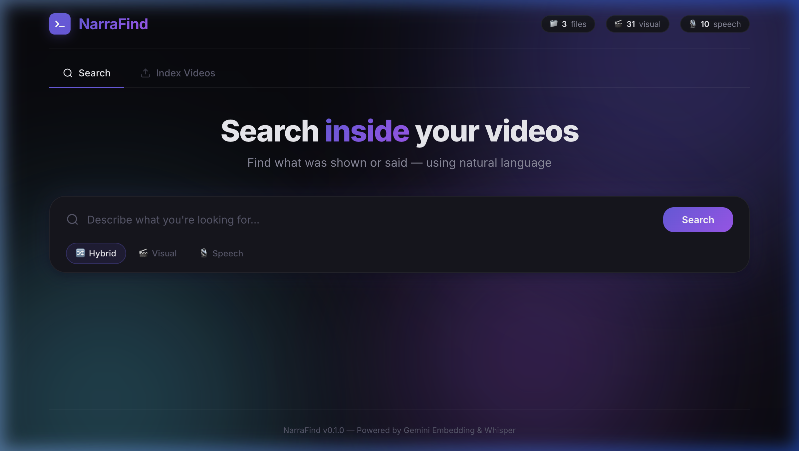
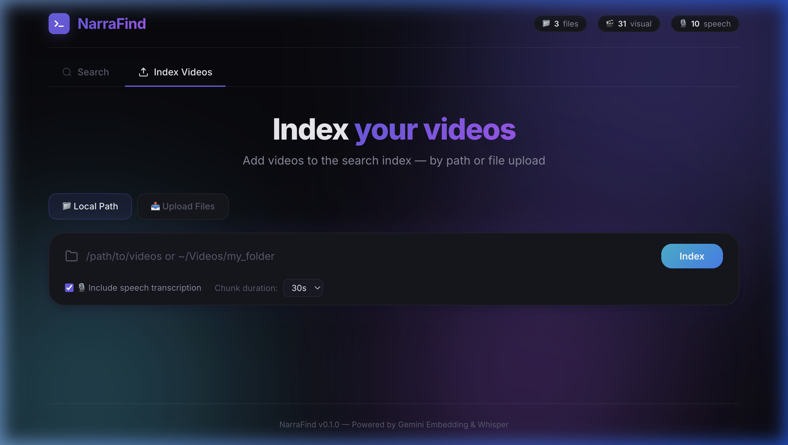
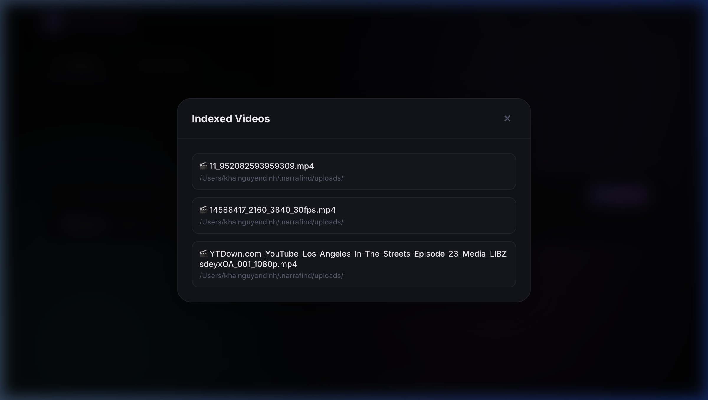

# NarraFind


Search inside long videos using natural language — find what was **shown** or **said**.

## How it Works

NarraFind splits your videos into overlapping chunks and indexes them in two ways:

- **🎬 Visual search** — Each video chunk is embedded as video using Google's Gemini Embedding API, enabling you to search by describing what you *see* (e.g., "red car at an intersection").
- **🎙️ Speech search** — Audio is transcribed using OpenAI's Whisper model, then embedded as text, enabling you to search by what was *said* (e.g., "talking about Vietnam").
- **🔀 Hybrid search** — Combines both visual and speech scores for the best results.

All vectors are stored in a local ChromaDB database. When you search, your text query is embedded into the same vector space and matched against stored embeddings.

## Getting Started

### 1. Install

```bash
# Install uv (if you don't have it)
curl -LsSf https://astral.sh/uv/install.sh | sh

# Clone and install
git clone https://github.com/khai-nguyen-dinh/narrafind.git
cd narrafind
uv tool install .
```

### 2. Set up your API key

```bash
narrafind init
```

This prompts for your Gemini API key, writes it to `~/.narrafind/.env`, and validates it.

> Get a free API key at [aistudio.google.com/apikey](https://aistudio.google.com/apikey)

### 3. Index your videos

```bash
narrafind index /path/to/videos
```

This will:
- Split videos into 30-second overlapping chunks
- Embed each chunk visually using Gemini
- Transcribe audio using Whisper and embed the text

Options:
- `--chunk-duration 30` — seconds per chunk
- `--overlap 5` — overlap between chunks
- `--no-preprocess` — skip downscaling
- `--no-speech` — skip speech indexing
- `--whisper-model base` — Whisper model size (tiny/base/small/medium/large)
- `--language en` — language code for transcription

### 4. Search

```bash
# Hybrid search (visual + speech)
narrafind search "talking about Vietnam"

# Visual only
narrafind search "red truck at a stop sign" --mode visual

# Speech only
narrafind search "mentions artificial intelligence" --mode speech
```

Options:
- `--mode hybrid|visual|speech` — search mode
- `-n 10` — number of results
- `--no-trim` — don't auto-trim the top result
- `--threshold 0.35` — confidence cutoff

### 5. Web UI

```bash
narrafind serve
```

Opens a beautiful web interface at `http://localhost:5000` where you can:
- **Search:** Find and trim video clips using Hybrid (visual+speech) matching.


- **Index Videos:** Add videos easily through path targeting or Drag & Drop file uploads.


- **Manage Indexed Data:** View stats and check exactly which video files are indexed and searchable.


## Usage

### CLI Commands

| Command | Description |
|---|---|
| `narrafind init` | Set up your Gemini API key |
| `narrafind index <path>` | Index video files for searching |
| `narrafind search <query>` | Search indexed footage |
| `narrafind serve` | Start the web UI |
| `narrafind stats` | Show index statistics |
| `narrafind remove <files>` | Remove specific files from the index |
| `narrafind reset` | Delete all indexed data |

### Managing the Index

```bash
# Show index info
narrafind stats

# Remove specific files by path substring
narrafind remove path/to/video

# Wipe the entire index
narrafind reset
```

## Architecture

```
Video File
    │
    ├── chunk_video() → 30s overlapping chunks
    │       │
    │       ├── [Visual] Gemini embed video chunk → ChromaDB (narrafind_visual)
    │       │
    │       └── [Speech] Whisper transcribe → Gemini embed text → ChromaDB (narrafind_speech)
    │
Search Query
    │
    └── Gemini embed text → search both collections → merge & re-rank → results
```

## Supported Formats

`.mp4`, `.mov`, `.mkv`, `.webm`, `.avi`

## Requirements

- Python 3.11+
- `ffmpeg` on PATH (or bundled via `imageio-ffmpeg`)
- Gemini API key ([get one free](https://aistudio.google.com/apikey))

## Cost

Indexing uses the same Gemini Embedding API as SentrySearch:
- ~$2.84/hr of video for visual embedding (30s chunks, 5s overlap)
- Speech embedding (text) is negligible
- Search queries are negligible

## License

MIT — see [LICENSE](LICENSE).
