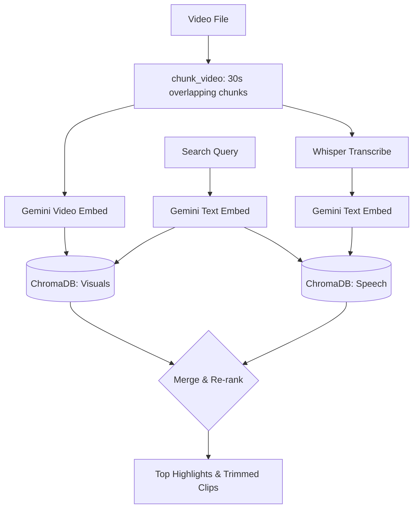

<div align="center">

# 🎬 NarraFind 
**Your Local "Google Search" for Videos**

[](https://www.python.org/)
[](https://flask.palletsprojects.com/)
[](https://aistudio.google.com/)
[](https://github.com/openai/whisper)
[](https://www.trychroma.com/)
[](LICENSE)

*Ever remembered a specific moment from a 2-hour video but couldn't find it? NarraFind solves this. Search inside long videos using natural language — find exactly what was **shown** or **said**, instantly.*

[Get Started](#-getting-started) • [Features](#-key-features) • [How it Works](#-how-it-works) • [Web UI](#-beautiful-web-ui)

</div>

---

## ✨ Key Features

- **🧠 True Multimodal Search**: Searches both the **visuals** (what is happening on screen) and the **audio** (what is being said) simultaneously using Gemini 2 and Whisper.
- **⚡ Blazing Fast Retrieval**: Powered by ChromaDB, enabling you to query hours of footage in milliseconds. 
- **🌐 YouTube & Web URL Support**: Directly download and index videos from YouTube via `yt-dlp` integration right inside the Web UI.
- **✂️ Auto-Trimming**: Found the exact clip? NarraFind automatically trims and exports the specific segment for you.
- **🖥️ Beautiful Local UI**: A sleek, drag-and-drop dashboard to index, search, and manage your video library effortlessly.
- **🔒 Private DB**: Your embeddings and vectors live entirely on your machine.

---

## 🚀 Getting Started

### 1. Installation

NarraFind is extremely easy to install using `uv`:

```bash
# Install uv (if you don't have it)
curl -LsSf https://astral.sh/uv/install.sh | sh

# Clone and install
git clone https://github.com/khai-nguyen-dinh/narrafind.git
cd narrafind
uv tool install .
```

*Note: Make sure you have `ffmpeg` installed on your system (e.g. `brew install ffmpeg` or `sudo apt install ffmpeg`).*

### 2. Set up API Key

NarraFind uses the Gemini API for multi-modal embeddings (it's incredibly cheap/free).

```bash
narrafind init
```
This will prompt for your Gemini API key, write it to `~/.narrafind/.env`, and automatically validate it. *(Get a free API key at [aistudio.google.com/apikey](https://aistudio.google.com/apikey))*

---

## 🖥️ Beautiful Web UI

Don't want to use the terminal? NarraFind comes with a stunning built-in web dashboard.

```bash
narrafind serve
```
Open `http://localhost:5000` in your browser to access the dashboard.

- **Search:** Find and trim video clips using Hybrid (visual+speech) matching.
- **Index Videos:** Add videos easily through local path targeting, Drag & Drop uploads, or **Direct YouTube / Web Video URLs**. Choose your Whisper model directly from the UI.
- **Manage Indexed Data:** View stats and remove specific indexed videos at the click of a button.

---

## 🛠️ CLI Usage

If you prefer the terminal, NarraFind's CLI is extremely powerful.

### Index your videos
Add videos to your local vector database:

```bash
narrafind index /path/to/my/videos
```
*Options:*
- `--chunk-duration 30` — seconds per chunk
- `--overlap 5` — overlap between chunks
- `--whisper-model medium` — Choose an OpenAI Whisper model (`tiny`, `base`, `small`, `medium`, `large`).

### Search your footage
Use natural language to find exactly what you're looking for:

```bash
# Hybrid search (Combining visual context + spoken words)
narrafind search "talking about artificial intelligence"

# Visual only (Searching objects, actions, scenes)
narrafind search "a red truck arriving at a stop sign" --mode visual

# Speech only (Searching transcriptions)
narrafind search "you said you would do it" --mode speech
```

### Complete CLI Reference

| Command | Description |
|---|---|
| `narrafind init` | Set up your Gemini API key |
| `narrafind index <path>` | Index video files for searching |
| `narrafind search <query>` | Search indexed footage |
| `narrafind serve` | Start the web UI |
| `narrafind stats` | Show index statistics |
| `narrafind remove <files>` | Remove specific files from the index |
| `narrafind reset` | Delete all indexed data |

---

## 🧠 How it Works

NarraFind splits your videos into overlapping chunks and indexes them in two parallel ways:

1. **🎬 Visual search:** Each video chunk is embedded directly as a video using Google's Gemini Embedding API.
2. **🎙️ Speech search:** Audio is extracted and transcribed using OpenAI's Whisper model locally, then embedded as text.

All vectors are stored in a local **ChromaDB** database. When you search, your query is mathematically matched against both visual and speech embeddings simultaneously (Hybrid Search).



## 💵 Cost Estimation

Indexing uses the Gemini Embedding API:
- **Visuals:** ~$2.84/hr of video (30s chunks, 5s overlap). *Note: The Free Tier covers a massive amount of personal use.*
- **Speech embedding & Search queries:** Essentially free/negligible.
- **Audio Transcription:** 100% Free (runs locally via OpenAI Whisper).

## 📄 License

MIT — see [LICENSE](LICENSE). Feel free to use, modify, and distribute this project. Stars are appreciated! ⭐
